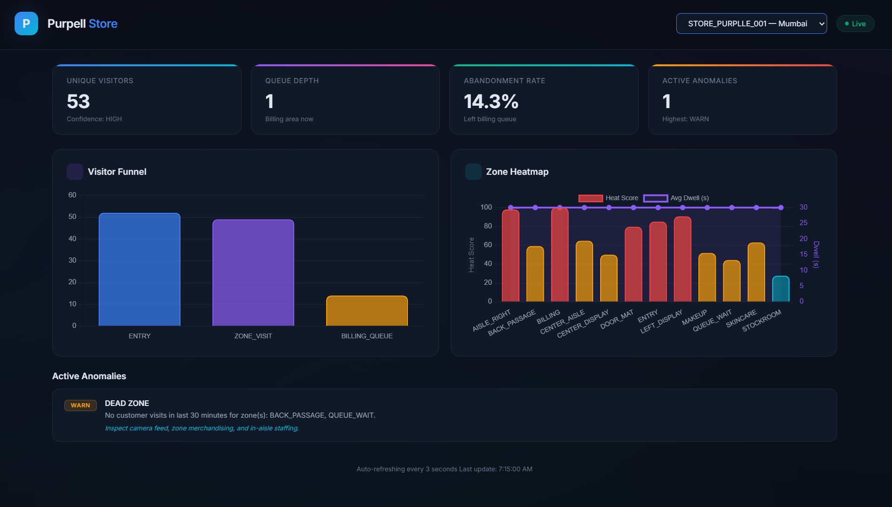

# Purpell Store (End-to-End)



A production-grade, containerized Purpell Store system that processes raw CCTV footage through YOLOv8 person detection, emits structured behavioral events, and serves live retail analytics via a REST API with real-time dashboard.

## What this project includes

- `pipeline/`: YOLOv8 detection pipeline with centroid-IoU tracker, vertical/horizontal line-crossing entry/exit detection, ROI-based zone assignment, staff camera auto-flagging, and zone assignment. Falls back to simulation when no clips are present.
- `app/`: FastAPI intelligence API with idempotent ingest, metrics, funnel, heatmap, anomalies, and health endpoints.
- `dashboard/`: Web dashboard (Chart.js) + terminal dashboard (rich) showing live metrics.
- `tests/`: Automated tests with prompt provenance blocks and >70% coverage.
- `docs/`: `DESIGN.md` and `CHOICES.md` with architecture and decision documentation.

## Quickstart in 5 commands

```bash
git clone <your-repo-url>
cd store-intelligence
python -m venv .venv && source .venv/bin/activate  # Windows: .venv\Scripts\activate
pip install -r requirements-dev.txt
docker compose up --build
```

The API will be available at `http://localhost:8000`.
The web dashboard will be at `http://localhost:8000/dashboard`.

## Run detection pipeline against CCTV clips

### Real CV processing (YOLOv8)

1. Place CCTV clips in a directory (e.g., `CCTV Footage/` or `data/clips/`).
2. Run:

```bash
# Process all clips with YOLOv8 detection
python -m pipeline.detect \
  --clips-dir "CCTV Footage" \
  --store-layout data/sample/store_layout.json \
  --output data/events.jsonl \
  --mode auto \
  --frame-skip 2 \
  --confidence-threshold 0.30

# Then replay events into the running API
python -m pipeline.detect \
  --clips-dir "CCTV Footage" \
  --store-layout data/sample/store_layout.json \
  --output data/events.jsonl \
  --ingest-url http://localhost:8000/events/ingest \
  --mode auto
```

### Simulation mode (no clips required)

```bash
python -m pipeline.detect \
  --mode sim \
  --store-layout data/sample/store_layout.json \
  --output data/events.jsonl \
  --ingest-url http://localhost:8000/events/ingest
```

### CLI options

| Flag | Default | Description |
|------|---------|-------------|
| `--mode` | `auto` | `auto` (try CV, fall back to sim), `cv` (require clips), `sim` (simulation) |
| `--clips-dir` | `data/clips` | Path to CCTV clips directory |
| `--model` | `yolov8n.pt` | YOLOv8 model variant (n/s/m/l/x) |
| `--frame-skip` | `2` | Process every Nth frame (higher = faster) |
| `--confidence-threshold` | `0.30` | Minimum detection confidence |
| `--realtime` | off | Replay events with timing delays |
| `--speed` | `12.0` | Realtime replay acceleration factor |

## API endpoints

| Endpoint | Method | Description |
|----------|--------|-------------|
| `/events/ingest` | POST | Ingest up to 500 events; validates, deduplicates by `event_id`, partial success |
| `/stores/{id}/metrics` | GET | Unique visitors, dwell, queue depth, abandonment |
| `/stores/{id}/funnel` | GET | Session-level Entry  Zone Visit  Billing Queue funnel |
| `/stores/{id}/heatmap` | GET | Zone visit intensity and average dwell normalized 0-100 |
| `/stores/{id}/anomalies` | GET | Queue spike, and dead-zone anomalies |
| `/health` | GET | Service status, last event per store, stale feed detection (>10 min) |

All metric endpoints accept an optional `?as_of=<ISO-8601>` parameter to query a specific time window.

## Live dashboard (Part E)

### Web dashboard (recommended)

Start the API and open: `http://localhost:8000/dashboard`

If events are from a past date, append the query parameter:
`http://localhost:8000/dashboard?as_of=2026-03-03T16:00:00Z`

### Terminal dashboard

```bash
python -m dashboard.live_dashboard --api-base http://localhost:8000 --store-id STORE_PURPLLE_001
```

For past-date events:
```bash
python -m dashboard.live_dashboard --store-id STORE_PURPLLE_001 --as-of 2026-03-03T16:00:00Z
```

## Testing and coverage

```bash
pytest --cov=app --cov=pipeline
```

**Current Test Coverage**: 70.53%
Coverage gate is configured in `pytest.ini` (`--cov-fail-under=70`).

## Operational notes

- **Structured logging**: Every request logs `trace_id`, `store_id`, `endpoint`, `latency_ms`, `event_count`, `status_code` as JSON.
- **Graceful degradation**: Storage failures  structured `503` responses with error code. No raw stack traces.
- **Idempotency**: `POST /events/ingest` is safe to call twice with the same payload via `INSERT OR IGNORE` on `event_id`.
- **Docker healthcheck**: Container reports health via `/health` endpoint every 30 seconds.
- **CORS**: Enabled for dashboard development.

## Project structure

```text
store-intelligence/
 pipeline/
    detect.py          # YOLOv8 detection + simulation fallback
    tracker.py         # CentroidTracker (IoU) + VisitorTracker (sessions)
    emit.py            # Event schema + JSONL emission
    run.sh             # One-command pipeline runner (Linux/Mac)
    run.ps1            # One-command pipeline runner (Windows)
 app/
    main.py            # FastAPI entrypoint + middleware + dashboard mount
    analytics.py       # Metrics, funnel, heatmap, anomaly computation
    storage.py         # SQLite persistence + idempotent ingest
    models.py          # Pydantic event schema + response models
    config.py          # Environment-based configuration
    reference_data.py  # Store layout + POS transaction loaders
    logging_utils.py   # Structured JSON logging
    errors.py          # Custom exception types
    utils.py           # Timestamp parsing, visitor ID canonicalization
 dashboard/
    web/
       index.html     # Chart.js web dashboard (served at /dashboard)
    live_dashboard.py  # Terminal dashboard (rich)
 tests/
    test_pipeline.py   # Pipeline schema compliance + determinism
    test_ingestion.py  # Ingest idempotency + batch limits
    test_metrics.py    # Staff exclusion, conversion, empty store, all-staff
    test_funnel.py     # Re-entry deduplication in funnel
    test_heatmap.py    # Low confidence + normalization
    test_anomalies_and_health.py  # Queue spike, stale feed, 503, empty DB
 scripts/
    replay_events.py   # Standalone event replayer
 data/
    sample/
        store_layout.json
        sample_events.jsonl
 docs/
    DESIGN.md          # Architecture + AI-assisted decisions
    CHOICES.md         # 3 decisions with full reasoning
 docker-compose.yml
 Dockerfile
 requirements.txt
 requirements-dev.txt
 pytest.ini
 README.md
```

